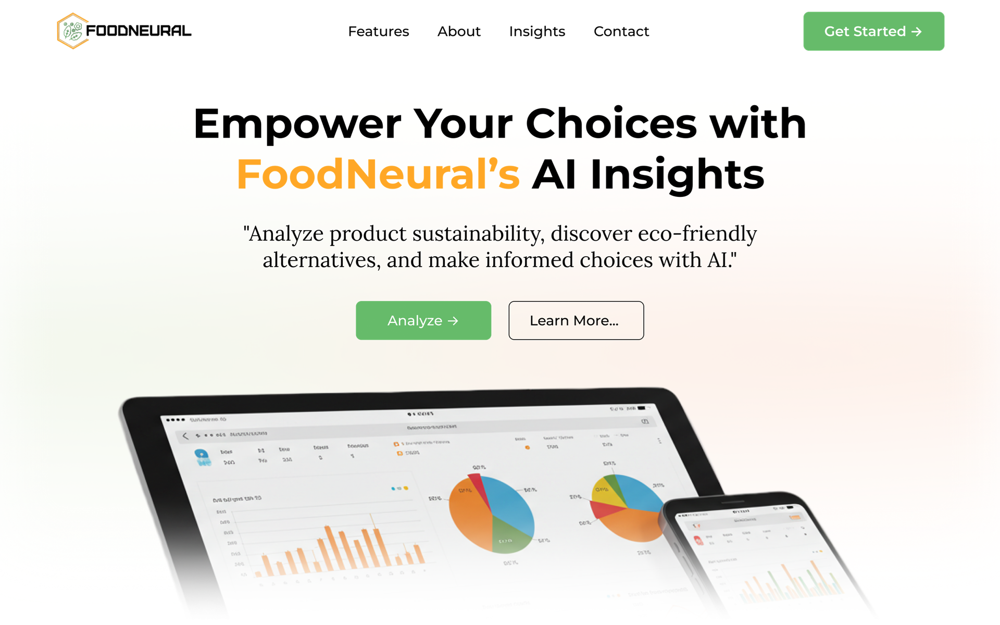
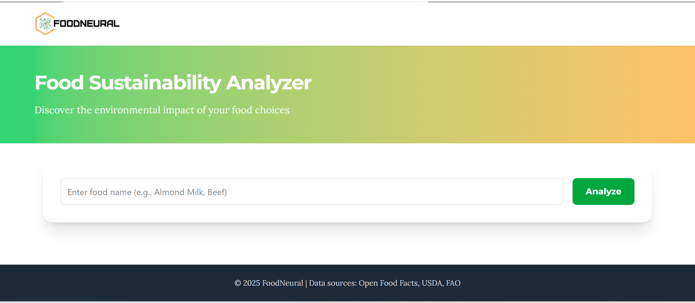
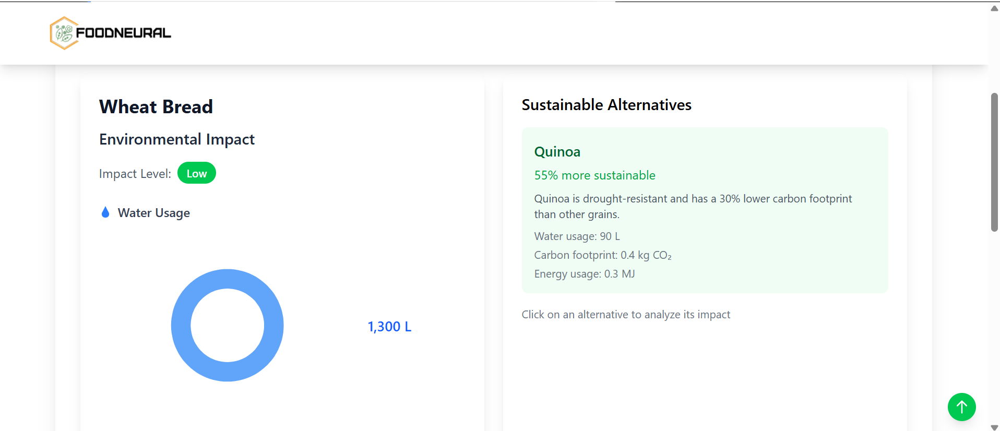
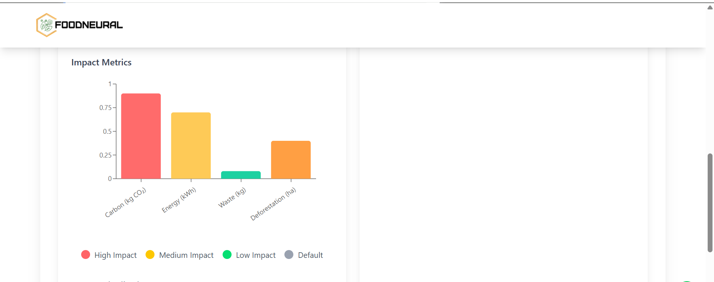

# FoodNeural 🌱

FoodNeural is an AI-powered sustainable food recommendation system that helps users make environmentally conscious food choices by analyzing and suggesting eco-friendly alternatives.

## Live Demo

[FoodNeural App](https://foodneural.vercel.app)

## Blog Post

[Building FoodNeural: AI-Powered Sustainable Food Recommendations](https://medium.com/@pascal.amah10/foodneural-using-ai-to-make-sustainable-food-choices-551428422bb4)

## Author

- [Pascal Amaliri](https://www.linkedin.com/in/pascal-amaliri/) - Full Stack Developer

## Features

- 🔄 Real-time food impact analysis
- 🌿 Sustainable food alternatives recommendations
- 📊 Environmental impact visualization
- 🤖 AI-powered recommendations
- 📱 Responsive design

## Screenshots

### FoodNeural Landing Page


_Detailed environmental impact breakdown of selected food items_

### Search and Suggestions


_Real-time food search with smart suggestions_

### Food Impact Analysis


_Detailed environmental impact breakdown of selected food items_


_Detailed environmental impact breakdown of selected food items_

## Tech Stack

### Frontend

- React + Vite
- TailwindCSS
- Framer Motion
- Axios

### Backend

- Flask (Python)
- spaCy NLP
- scikit-learn
- NumPy

## Installation

### Prerequisites

- Python 3.9+
- Node.js 16+
- npm or yarn

### Backend Setup

```bash
cd backend
python -m venv venv
.\venv\Scripts\activate
pip install -r requirements.txt
python -m spacy download en_core_web_sm
```

### Frontend Setup

```bash
cd frontend
npm install
```

### Environment Variables

Create `.env` files in both frontend and backend directories:

Backend `.env`:

```
FLASK_ENV=development
SECRET_KEY=your-secret-key
```

Frontend `.env`:

```
VITE_APP_URL=http://localhost:5000
```

## Usage

### Running the Development Server

1. Start the backend:

```bash
cd backend
.\venv\Scripts\activate
python app.py
```

2. Start the frontend:

```bash
cd frontend
npm run dev
```

3. Visit `http://localhost:5173` in your browser

## API Endpoints

### Food Impact

```
GET /api/impact/<food_name>
```

### Recommendations

```
GET /api/recommendations/<food_name>
Parameters:
- use_ai (boolean): Use AI recommendations
- limit (int): Number of recommendations
```

### Search

```
GET /api/search
Parameters:
- q (string): Search query
```

## Contributing

1. Fork the repository
2. Create your feature branch (`git checkout -b feature/AmazingFeature`)
3. Commit your changes (`git commit -m 'Add some AmazingFeature'`)
4. Push to the branch (`git push origin feature/AmazingFeature`)
5. Open a Pull Request

## Related Projects

- [Open Food Facts](https://world.openfoodfacts.org/)
- [Environmental Impact of Foods](https://ourworldindata.org/environmental-impacts-of-food)

## License

This project is licensed under the MIT License - see the [LICENSE](LICENSE) file for details.

## Acknowledgments

- Environmental impact data from FAO
- Food database from USDA
